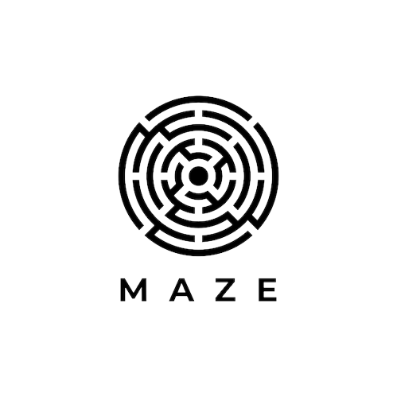

<!-- PROJECT LOGO -->
 

  

  <h3 align="center">Auto MAZE Pygame</h3>

  

    A maze game, user play and auto solve using notrain AI algorithm
     
    <a href="https://github.com/ThongNguyenDT/ai_maze"><strong>Try it now »</strong></a>
     
     
    <a href="https://github.com/ThongNguyenDT/ai_maze">View Demo</a>
    ·
    <a href="https://github.com/ThongNguyenDT/ai_maze/issues">Report Bug</a>
    ·
    <a href="https://github.com/ThongNguyenDT/ai_maze/issues">Request Feature</a>
  

